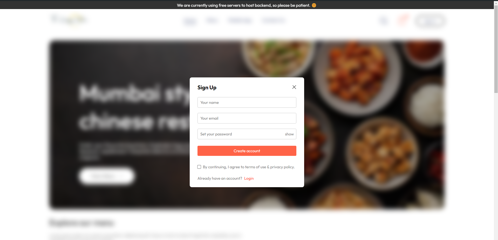

<div align="center">

# Only Food Delivery App

</div>

<a href="https://tomato-food-delivery.onrender.com">
Website </a>
<p> This is a web app built using React JS for frontend and Node JS, Express for creating the REST APIs along with Mongo DB to store data. 
</p>
<p>
It has an admin panel where we can track order, add update new food items, and edit order status.
</p>

# Key Features
- Used JWT for secured authentication and authorization
- Used Cloudinary to save image files on cloud for faster retrieval
- Used local storage to save user cart items
- Integrated COUPON CODE system
- Integrated payment system by Stripe
- Multiple payment options available including Cash On Delivery
- Advanced order tracking system

# Tech Stack used

- React JS
- Node JS
- Express
- Mongo DB

# Libraries used

- Axios
- Toastify
- JWT
- Multer
- Cloudinary
- bcrypt
- Stripe
- Validator


&nbsp;

&nbsp;

&nbsp;

&nbsp;

&nbsp;


# How to run in your local server

1. Clone this repo.
2. Open each directory in separate terminals.
3. "npm install" in all 3 terminals.
4. Finally, "npm run dev" in all 3 terminals.

# Access the live version

```
https://tomato-food-delivery.onrender.com
```

<a href="https://tomato-food-delivery.onrender.com">
Website </a>

<p>
Only Food Delivery App is an innovative online food ordering app designed to streamline the process of getting your favorite meals delivered right to your doorstep. The app is built with React JS for the frontend, and Node JS and Express for creating the REST APIs. It leverages MongoDB to store data, ensuring a robust and scalable backend. This combination of technologies ensures a smooth and efficient user experience, from browsing the menu to placing an order and tracking its delivery.

One of the standout features of Only Food Delivery App is its admin panel, which provides comprehensive order management capabilities. Administrators can track orders in real-time, add or update food items, and edit the status of orders, all from a single interface. This makes it easier to manage the flow of orders and ensure timely deliveries.

Security is a top priority for Only Food Delivery App, which is why it uses JWT for authentication and authorization. This ensures that user data is kept secure and that only authorized users can access certain parts of the app. JWT is a widely used technology for securing web applications, making it a reliable choice for Only Food Delivery App.

To enhance the user experience, Only Food Delivery App uses Cloudinary to store image files on the cloud. This not only speeds up the retrieval of images but also reduces the load on the server, resulting in faster load times for users. Cloudinary is known for its robust image management capabilities, making it a perfect fit for Only Food Delivery App.

Local storage is used to save user cart items, allowing users to pick up where they left off even if they navigate away from the app. This feature enhances the convenience for users, as they don’t have to start over every time they use the app. It’s a small but significant feature that improves the overall user experience.

The app also features an integrated coupon code system, allowing users to apply discounts and save money on their orders. This adds a layer of excitement and encourages users to keep coming back for more. The coupon system is flexible and easy to manage, making it a valuable addition to the app.

Payment integration is handled by Stripe, a leading payment processing platform. Stripe supports multiple payment options, including credit cards, debit cards, and even Cash On Delivery. This flexibility ensures that users can choose the payment method that best suits their needs. Stripe’s robust security features also ensure that all transactions are secure.

One of the key features of Only Food Delivery App is its advanced order tracking system. Users can track their orders in real-time, from the moment they place the order to the moment it’s delivered. This transparency builds trust and keeps users informed every step of the way.

The tech stack used to build Only Food Delivery App includes React JS for the frontend, Node JS for the server-side logic, Express for building the REST APIs, and MongoDB for the database. This combination of technologies ensures a seamless and efficient user experience. React JS is known for its flexibility and performance, making it an ideal choice for the frontend. Node JS and Express are widely used for building scalable and efficient server-side applications, and MongoDB provides a flexible and scalable database solution.

Several libraries have been used to enhance the functionality of Only Food Delivery App. Axios is used for making HTTP requests, Toastify is used for displaying notifications, and JWT is used for authentication. Multer and Cloudinary are used for handling file uploads and storage, while bcrypt is used for hashing passwords. Stripe is used for payment processing, and Validator is used for validating user input.

The app also includes several screenshots that showcase its user interface and features. These screenshots provide a visual representation of the app, giving users a glimpse of what to expect. From the clean and intuitive design to the detailed order tracking, the screenshots highlight the key features of Only Food Delivery App.

Running Only Food Delivery App on a local server is straightforward. Users need to clone the repository, open each directory in separate terminals, run `npm install` in all terminals, and finally run `npm run dev` in all terminals. This simple setup process makes it easy for developers to get started with Only Food Delivery App.

Only Food Delivery App is designed to be compatible with all major browsers, including IE10, IE11, Edge, Firefox, Chrome, Safari, iOS Safari, and Opera. This ensures that users can access the app from any device, regardless of the browser they are using. Cross-browser compatibility is a crucial aspect of modern web applications, and Only Food Delivery App has been designed with this in mind.

In summary, Only Food Delivery App is a comprehensive and user-friendly online food ordering app. Its robust tech stack, advanced features, and secure authentication make it a reliable choice for both users and administrators. Whether you’re looking to order your favorite meals or manage a food delivery service, Only Food Delivery App has you covered. With its intuitive design and powerful features, Only Food Delivery App is set to revolutionize the way we order food online.
</p>
